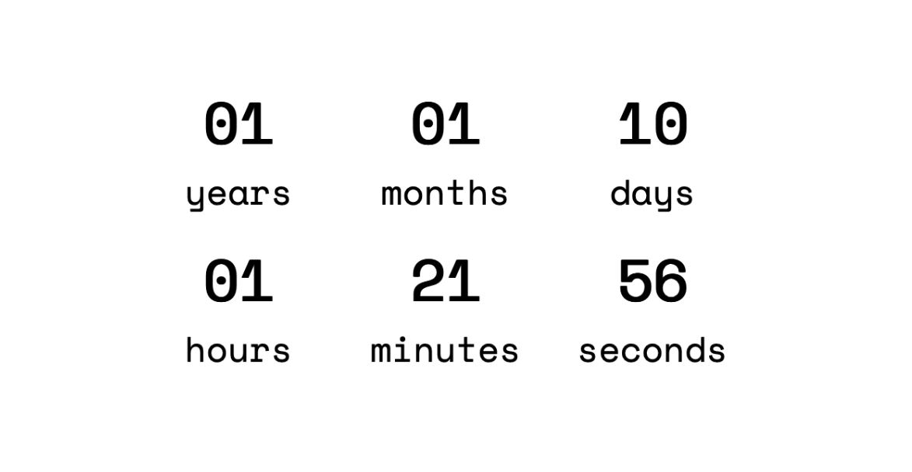
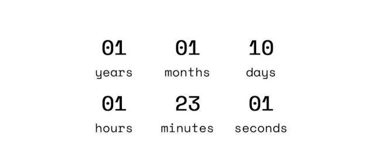
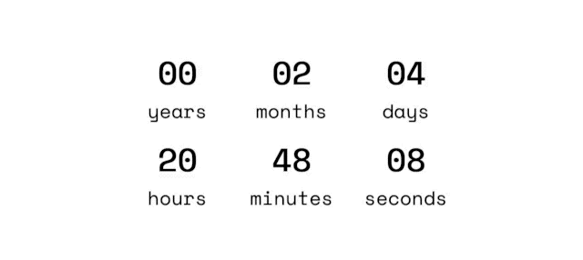

What is a count up timer? A count up timer is the opposite of the countup timer. Instead of counting **to zero**, this timer counts **from zero**. It can serve multiple purposes, such as for counting the duration of a workout, duration of screen usages in a day or week, or... for my case, counting the duration since I got married. In this post, I will be sharing a bit about the process in creating a count up timer.

## Defining the "start time"

The first thing we need to do is to define the "zero point"—everything has to start somewhere. For me, I defined the start time as the second I got married to my wife ([link to the count up site](https://imballinst.github.io/married)). Up to second? But, how?



This part is a bit tricky. My wedding event was live on my wife's Instagram account and hence it was stored on her Instagram TV (we didn't use fancy recordings with timestamps). Now, Instagram has this "posted date" on every post. However, there are 2 problems here. The first one is the UI does not show the exact timestamp (it only shows how long since the post was published, such as "2w") and the second one is, because of the first problem, I could not know the exact timestamp when the chief said "confirmed" (or in Indonesian, "sah").

I will try to explain these issues using an example post from one of [ffxiv's Instagram post](https://www.instagram.com/p/CQRCJgqF-vB/). The screenshot can be seen below.


From the screenshot above, it is known that the post was posted 9 weeks ago (shortened to "9w"). That still doesn't explain the exact date and time. I tried to search the solution in Google and I found out that [there was a way to extract these information](https://www.followchain.org/exact-time-instagram-post)! We don't need to install anything, we can just use our favorite browser in our PC. What we need to do is, we right click on the date (in my example above, it was "9w"), then click "Inspect". It will open some kind of drawer in your browser like the picture below.


As seen from the screenshot aboev, inside the drawer, there will be a "selection" (indicated by the blue color). This is the element that we chose to inspect before. The content is as the following:

```html
<time
  class="FH9sR Nzb55"
  datetime="2021-06-18T15:13:38.000Z"
  title="Jun 18, 2021"
>
  9w
</time>
```

Now, we have 3 important information here. The first one is the content of the tag `datetime`, the second one is the `title` (which shows up when we hover on the date element), and the last one is the actual shown text, "10w", which stands for 10 weeks ago. Since our objective is to get the timestamp, `2021-04-19T13:01:01.000Z` is the text that we need to take. That text is a representation of date in [ISO 8601](https://www.w3.org/TR/NOTE-datetime) string.

That was how I got the post date of the recorded event. I moved to the second problem (pun not intended). When did the chief confirmed our marriage? When was the exact time? So, given the initial timestamp, I saw the recorded video's duration. I thought, maybe I could count from behind until the second in the video where the chief confirmed. I did just that and finally I got the timestamp that I wanted.

Now, let's get to the site building part!

## Building the timer

This is the [file in the repository](https://github.com/imballinst/married/blob/master/date.js) that I am referring to. I am only using plain HTML/CSS/JS for that site and as a disclaimer, the calculation may not be the most efficient performance-wise. I chose to not handle it since it does not cause major performance degradation... yet.

So, here is the outline of the steps that my code does to get the "duration since":

1. Get initial timestamp
2. Get current timestamp
3. Get the difference of years
4. Get the difference of months
5. Get the difference of days
6. Get the effective difference of years
7. Get the effective difference of months
8. Get the effective difference of days
9. Render the dates accordingly (with Monospace fonts and padded with 0s)

The full code can be found [here in the GitHub repository](https://github.com/imballinst/married/blob/master/date.js).

### Constants

First and foremost, I have this list of constants to prevent myself from being inconsistent when doing the calculations. This—from my perspective—is better than having too many asterisks when calculating the smallest unit of time (in this case, millisecond).

```js
const ONE_MINUTE_IN_SECONDS = 60;
const ONE_HOUR_IN_SECONDS = ONE_MINUTE_IN_SECONDS * 60;
const ONE_DAY_IN_SECONDS = ONE_HOUR_IN_SECONDS * 24;
const ONE_DAY_IN_MILLISECONDS = ONE_DAY_IN_SECONDS * 1000;
// From Instagram tag: `<time class="_1o9PC Nzb55" datetime="2020-07-12T03:04:06.000Z" title="Jul 12, 2020">July 12</time>`.
// Instagram datetime post: 2020-07-12T03:04:06.000Z.
// Time-stamp the "ijab qabul" was done: 39:21/59:54 -- so there is 20 mins and 33 secs to go.
// Add the datetime to GMT+7, 10:04:06.
// Subtract the datetime with 20 mins and 33 secs -- 09:43:33.
const WEDDING_DATE = new Date(2020, 6 /* July */, 12, 9, 43, 33);
```

As for the `WEDDING_DATE` variable, the values were taken out directly from the Instagram `time` HTML tag.

### Get initial and current time

This part is mostly straightforward, we are getting the initial time and current time.

```js
function calculate(currentDate = new Date()) {
  // ...
  const weddingMilliSeconds = WEDDING_DATE.getTime();
  const currentMilliSeconds = currentDate.getTime();
  // ...
```

The reason that I made `currentDate` a parameter was because I wanted to test them as well, which can be found [in this file](https://github.com/imballinst/married/blob/master/test.js). Now, back to the calculation...

### Get the date and time difference

When counting the time difference, we go from year to seconds. This is because year is the biggest unit that we want to render and it's the safest difference that we can calculate firsthand.

```js
const diff = currentMilliSeconds - weddingMilliSeconds;

// We can cut off years first as the number of days is static, 365 or 366.
years = currentDate.getFullYear() - WEDDING_DATE.getFullYear();

// For months and days, however, it's a little bit tricky.
const weddingMonth = WEDDING_DATE.getMonth();
const currentMonth = currentDate.getMonth();

// Don't forget to subtract this if date, hours, minutes, seconds is lesser.
months = currentMonth - weddingMonth;

// Days.
const weddingDateInMonth = WEDDING_DATE.getDate();
const currentDateInMonth = currentDate.getDate();

days = currentDateInMonth - weddingDateInMonth;
```

Notice something that might proof the difference calculation at fault here? Yes, there may be questions such as, "What if the current month number is lesser than the wedding month number?" and the same goes for the date. We will deal with that later, but first we need to calculate the time difference.

```js
// We use this to calculate time.
const daysRemainder = Math.floor((diff % ONE_DAY_IN_MILLISECONDS) / 1000);

// Time.
hours = floor(daysRemainder / ONE_HOUR_IN_SECONDS);
const hoursRemainder = daysRemainder % ONE_HOUR_IN_SECONDS;

minutes = floor(hoursRemainder / ONE_MINUTE_IN_SECONDS);
const minutesRemainder = hoursRemainder % ONE_MINUTE_IN_SECONDS;

seconds = minutesRemainder % ONE_MINUTE_IN_SECONDS;
```

Firstly, we get the number of days from the `diff` variable. We divide this by `ONE_DAY_IN_MILLISECONDS` since `diff` itself is in millisecond unit. Now, we have retrieved the date and time general difference, let's settle the details.

### Adjusting the details in the date and time difference

It is not 1 minute until it has reached 60 seconds, it is not 1 hour until it has reached 60 minutes, and it is not 1 day until it has reached 24 hours. This is the base idea that we will apply upon when adjusting the date and time difference. For the first step, we will want to adjust the day, hour, minute, and second.

```js
if (currentDateInMonth === weddingDateInMonth) {
  // Check hours.
  const weddingHours = WEDDING_DATE.getHours();
  const currentHours = currentDate.getHours();

  if (currentHours < weddingHours) {
    days -= 1;
  } else if (currentHours === weddingHours) {
    // Check minutes.
    const weddingMinutes = WEDDING_DATE.getMinutes();
    const currentMinutes = currentDate.getMinutes();

    if (currentMinutes < weddingMinutes) {
      days -= 1;
    } else if (currentMinutes === weddingMinutes) {
      // Check seconds.
      if (currentDate.getSeconds() < WEDDING_DATE.getSeconds()) {
        days -= 1;
      }
    }
  }
}
```

Now, what we are checking is whether the current date of month is the same as the wedding date of month. For example, January 1st has the same date of month if compared to February 1st. However, the hour, minute, or second perhaps can be different. We need to check them further.

When the current hour is lesser than the wedding hour, then we will reduce `days` by `1`. This is according to the base idea above, "it is not 1 day until it has reached 24 hours". Using the same idea, we apply the same rule for minute and the second. For example, "January 1st, 2021 13:10:44" compared to "February 1st, 13:10:43" is **not** 1 second short from exactly 1 month difference.

After getting the final the difference of days, only then we can finalize the difference of months and years safely.

```js
// If any of them is less than 1, set to maximum.
if (days < 0) {
  days += getNumberOfDaysInMonth(currentDate);
  months -= 1;
}

if (months < 0) {
  months = 12 + months;
  years -= 1;
}

return { years, months, days, hours, minutes, seconds };
```

## Result

Finally, we have it. Then, we just import it with `<script>` tag and run the `calculate` function for each second.

```html
<script src="date.js"></script>
<script>
  window.addEventListener('load', () => {
    const result = calculate();
    render(result);

    setInterval(() => {
      render(calculate());
    }, 1000);
  });
</script>
```

What we are doing with the snippet above is that, first, we import the `date.js` that we have in the same directory. After that, after the page has finished loading, we run the JavaScript to first immediately render the result to the page. After that, we set a one-second interval to automatically update the numbers on the screen. The result can be seen in the GIF below.

<figure class="gatsby-resp-image-figure" style="margin-bottom: 1rem; display: flex; flex-direction: column; align-items: center;">
  
  <figcaption class="gatsby-resp-image-figcaption">The finished countup timer. It ticks from "1 year, 1 month, 10 days, 1 hour, 23 minutes, 1 second" to "1 year, 1 month, 10 days, 1 hour, 23 minutes, 10 seconds".</figcaption>
</figure>

There you have it. The countup timer is finished. If you want to change the start date, you can change `WEDDING_DATE` to anything that that you want. For demonstration purposes, what if we use the Final Fantasy XIV post above? Let's try changing the initial date to the one specified in the post: `2021-06-18T15:13:38.000Z`. Note that when initializing with `new Date`, the month starts at 0 (January) and ends at 11 (December).

```diff-javascript
- const WEDDING_DATE = new Date(2020, 6 /* July */, 12, 9, 43, 33);
+ const POST_DATE = new Date(2021, 5 /* June */, 18, 15, 13, 38);
```

<figure class="gatsby-resp-image-figure" style="margin-bottom: 1rem; display: flex; flex-direction: column; align-items: center;">
  
  <figcaption class="gatsby-resp-image-figcaption">The timer since the post was published on the Final Fantasy XIV Instagram account. It ticks from "0 years, 2 months, 4 days, 20 hours, 48 minutes, 9 seconds" to "0 years, 2 months, 4 days, 20 hours, 48 minutes, 16 seconds".</figcaption>
</figure>

## Closing words

I hope you enjoy reading this tutorial. If you have any feedback, please feel free to reach me on my Twitter (you can visit it from the navigation bar above). Thanks!
