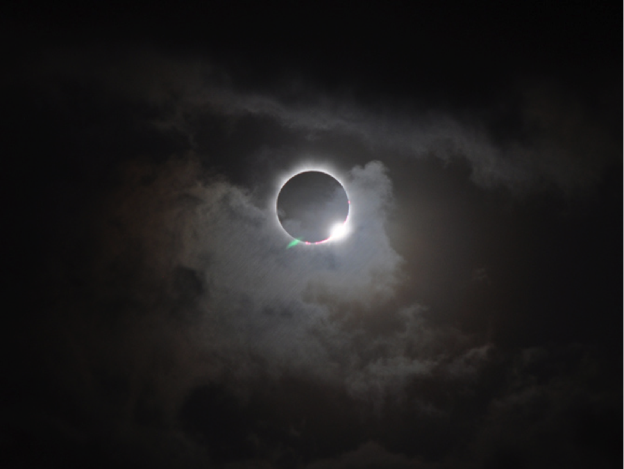

---

WARNING: This post **may** have some troubling parts in later sections. Proceed to read with care.

---

Normally, we will have day and night take turns on a day-to-day basis. A sunny day will switch into a moonlit night. Light will shift into darkness. After the darkest of the night, universe will present us with dawn -- where shortly after, sun will rise back up.

However, darkness doesn't exist only during the night. For example, every certain period of time, in a particular location, a phenomenon called "Solar Eclipse" _can_ happen, where [a portion of the Earth is engulfed in a shadow cast by the moon, which fully or partially blocks sunlight](https://en.wikipedia.org/wiki/Solar_eclipse).

How does this correlate with the real life? In this life, we surely will face a lot of struggles. There are ones that only last for a short time, however, there are also the ones that feel like they are going to last forever. For either case, our mind _might_ be really prone to negative thoughts -- it is as if there is a devil whispering to one of our ears about the darkest possible scenario that could ever happen.

In my case, there was an eclipse, and right after it ended, a pitch black from nighttime followed that up.

## Prelude

Before I begin, I'd like to let you know that I'm not expecting you to feel sorry for me. I am only expecting you to simply **be kind to others**. If they react negatively to your actions, first and foremost, you might want to ask yourself, _"Did **I** do something wrong?"_ instead of asking the other party _"What's wrong with **you**?"_ with judgmental tone.

## In the Past

I was a somewhat "crybaby" during my childhood, and I guess I still am, though perhaps in a different way(s). I think I felt like I wasn't capable of making any change, so when something happened not according to my expectations, my first reaction would be crying. In my home, when I did something wrong, my mother would yell at me, telling me about my mistakes. On certain occasions, I and my eldest brother would also argue, with him also asserting his dominance. Guess what, yes, instead of fighting back, I just cried and did nothing.

In my elementary school, I faced similar experiences as well. There were 2 events that I still remember to this day. The first one was during the art class, where we needed to dance. In that class, one of my friend was scolded quite hard by the teacher, and I thought it wasn't justified since my friend didn't make a fatal mistake. I really wanted to tell my teacher that, but again, I couldn't. Instead, I cried.

The second event was when it was the last class session of the day. When the bell rang, I immediately prepared to pack my belongings to my bag when my teacher yelled at me, telling that the session wasn't finished yet. Yes, it was premature of me of packing up before he even allowed it, and I think I deserved that warning. But... he didn't have to yell, did he? Before you ask me, yes, again, I cried.

God, I hate it so much when I was/am being a crybaby. It feels like I'm really powerless. I can't stand people with aggressive behavior, but I can't do anything about it and it hurts me even more. The more I think of it, crying for myself was probably a better way to vent out. At least I only made people irritated of my "crybaby" status. This was not the case when I was still in Junior High School, where I for the first time, let my emotions got the best of me. I am not proud of it.

It was around the first month since the school started. There was a group of students behind me who repeatedly mentioned my Chinese face (my mother was born in Medan, South Sumatra with a bit of Chinese blood in her, while my father was born in Klaten, Central Java). I also faced the same situation when I was in elementary school, but you probably can guess my reaction. So, yes, back to the story in Junior High School. If they only did that occasionally, I _probably_ would not mind. However, they were constantly doing that and it was getting on my nerves. This time, I didn't cry. I turned around and swung my hand. I ended up scratching the eyelid of the student who was sitting behind me... and it bled. After that, a teacher came and separated us to ease up the commotion. I wasn't thinking clearly, and it could have been really fatal. I could have destroyed the gift of vision in his left eye.

That was perhaps my turning point. When I was really frustrated, instead of hurting other people physically, I hurt myself, though sometimes I hurt other people emotionally as well with my sudden outburst. Which leads us to recent times.

## The Triggers

I didn't have the best relationship with my mother during my childhood, and I still don't. When I finished my Masters in Australia back in December 2019, I was offered a remote full-time job from a company where I worked part-time previously for ~15 months. I thought that by being at home, I could somewhat remedy my relationship with my mother, which hopefully would repair the relationship between my father and mother as well. They are still together, but their communication is just so off. So, I decided to take up that offer and planned to work from home when I returned to Indonesia.

Things went well, I could see they were getting better. I was getting used to my mother's constant rambling. I understand that my father was not able to be "contain" my mother's emotions, so I somewhat took his place. I thought everything would be just fine, but I couldn't be more wrong. When my mother rambled about 3 things, I immediately lost it.

### Women is Better than Men

Every time my father made a mistake, she immediately rushed to the conclusion that _"All men are like that"_, then proceeded to talk how women are always better in that matter. It really hurt -- yes I am a male like my father, but it doesn't mean that she could just lump me and him together. Not only that, when we did something that wasn't according to her expectation, she shrugged it off with something like, _"If you were female you would have done this and that"_.

Worse, she even generalized that all women have the same personality like her. I flinched. I know, I really know, there are a lot of women that don't act like my mother. They don't glorify their gender being better than others. They know their boundaries. They aren't manipulative.

### Retaliating Means Inability to Cooperate

Every time I got annoyed during a discussion (usually after I provided all the facts and she completely ignored it), she most of the times got angry and told me, _"There are people out there who say things harsher than I do. If you act like this, you won't be able to succeed out there"_. I read that as an excuse to her behavior. As a matter of fact, if I were that bad in cooperating with people, I wouldn't have landed a single job in my entire life.

### Only Women's Feelings Should be Recognized

When I was stressed out (usually from the discussion where my mother didn't want to give up her argument), my health began to decline. I lost my appetite, as well as couldn't get my brain to work properly. At the same time, my mother told me that when **women** are stressed, things could get out of hand -- such as they would cry to their sleep and get sick -- all that because they are women.

She was telling that to me, her own son, who was having exactly the same problem. Then, she just completely ignored my feelings and said that, _"No matter how bad your condition is because of your feelings, things won't change"_. Why didn't she say the same thing for women? It was as if only women are allowed to be sad. Last I checked, [men's suicide rate is higher than women's](https://www.bbc.com/future/article/20190313-why-more-men-kill-themselves-than-women). Given that fact, I believe both gender have equal rights to express their feelings.

## Dark Thoughts

These triggers ultimately led to a series of dark thoughts. I was feeling absolutely worthless. In my mind at that time, I didn't have a place in this world.

1. I thought about killing myself. Jumping from the balcony, jumping from the stairs, and stabbing myself with scissors were amongst the options. However, I wasn't brave enough to do one of them.
2. I considered indirect methods of self-harming, such as staying up late and eating a lot of fast food. It's not a "direct impact", but at the same time it will tax my age. At that time, I was convinced that I liked this option.
3. I wanted my father to remove my name from the family card, so there was a reason for me to "live alone".
4. I began to question whether Islam is the religion that brings "blessings for entire world". What my mother said did not really represent Islam at all. I know that one person, or one group, does not represent the whole community, but it was really hard to accept bad things when they came from the person who lived with you under the same roof.
5. I began to question the need to get married, as I would be dragging my wife to my dysfunctional family. By dragging her, I would make her feel the same pain like I did. I thought, _"Perhaps it's better to not get married at all?"_

When I was experiencing these thoughts, it felt weird. I was alive, but I didn't feel like alive. I was stuck in a thought-loop of negative emotions. I really wished if I could just die at that moment without feeling any pain, I would gladly do so. However, something stirred inside me. It was **empathy**.

## Empathy

If I chose suicide at that moment, I would not think at all about my mother's feelings. She disregarded my feelings, and that's all there is to it. What I felt was my father's sadness... as well as my soon-to-be-wife (at this time of writing). I could not stand seeing them hurting _that_ much, especially for my significant other. When we first committed to a serious relationship, I told her that I wanted to build a loving family, which provides physical and emotional support to all of its members. After that, the images of my dearest friends appeared as well... and I thought, it would really heartbreaking for them if they know that their friend killed himself.

I am still recovering at the moment. My sleep schedule is still messed up, and my work rate is still below my standard. These dark thoughts still linger, though not as strong as when the attack happened. My loved ones and my friends helped me, in a way.

With that said, _please, please, please,_ do not quickly come to the conclusion that people who suicided did not have empathy for their family and friends. We don't know how hard their struggle was. Therefore, it is best that we don't judge them.

## Closing Words

I did a lot of bad things because of the explosion of my emotions. I felt really bad -- and that was when I started taking my mental health seriously. I visited a psychologist twice (before this COVID-19 happened), read a lot of articles regarding this matter, as well as [watching some educational streams regarding mental health](https://www.twitch.tv/healthygamer_gg). Hopefully, one day I could control my emotions properly.

I'm closing this post with what I said in the "Prelude" section. I hope this serves as a reminder for me, too.

---

**Be kind to others**. If they react negatively to your actions, first and foremost, you might want to ask yourself, _"Did **I** do something wrong?"_ instead of asking the other party _"What's wrong with **you**?"_ with judgmental tone.

---
