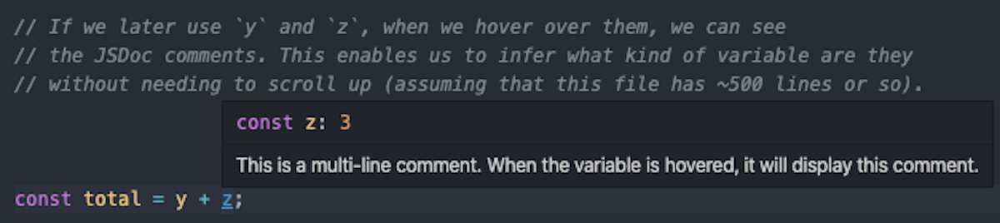
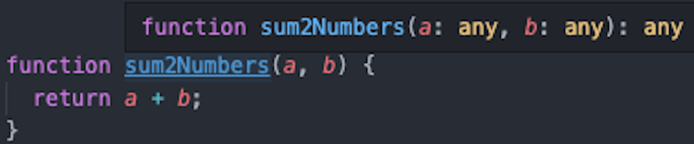
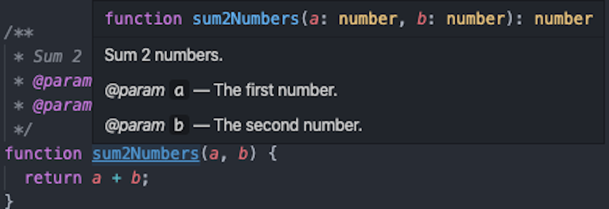
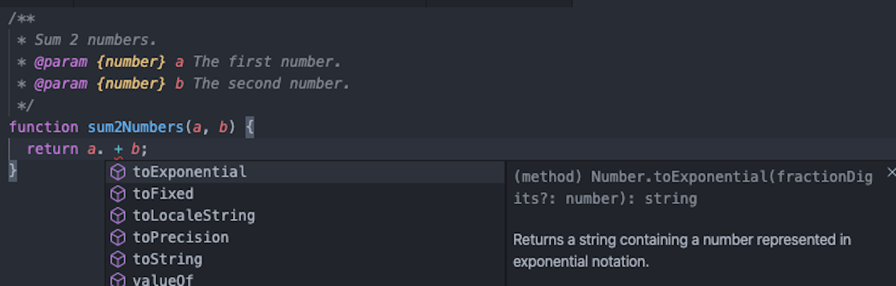
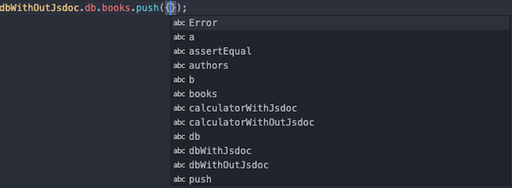

---

_In this post, I will be using the contents of this repository: https://github.com/Imballinst/jsdoc-sample._

---

I have been using TypeScript for almost 1 year and I've got to say, I really enjoy working with it every day. I feel someone -- or rather, something -- is watching me writing my code. If I have an error, it will scream next to my ear and it won't stop until I fix it. This is a blessing, well, most of the time anyways. There are times when I wanted to bang my head to the wall because there were cryptic errors that I couldn't quite solve easily.

While that's happening, I also have been reading other developers' thoughts on using TypeScript. Some are afraid to try it because it is intimidating, while some other really love it. Alright, so, what are the reasons I love TypeScript? It **guides** me.


Imagine walking through a blizzard. Normally, you will be able to see the road track, which keeps you on the road and prevents you from getting lost. However, during that blizzard, the road track is buried deep beneath the snow. You can't see where are you going. You can brute force your way to your destination by going in all possible directions, but how long will it take?

When you can see the road track, **you don't have to think**. You just follow that road track and eventually it will get you somewhere. If you are lost, then you can go back, using the same road track to your previous checkpoint.

This is similar with a codebase. A simple function is easy to consume, its track is clear. However, in a more complex function, the code flow _can_ be harder to follow, let alone if the variable names do not quite represent what they actually contain. For example, there is a variable named `books`. What is it? An array of string, or an array of `Book` objects? We don't know that in plain JavaScript -- unless the writer puts a comment on it.

Okay, nice -- so we can put a comment to "explain" a variable. However, how many lines of comments that you need to write if there are a lot of complex variables? The benefit that your team gets is really small compared to the effort that you do. TypeScript _can_ be the answer here, but let's assume that TypeScript is intimidating and we want to start slowly. Where do we start?

## Introducing JSDoc

You might have heard about [JSDoc](https://github.com/jsdoc/jsdoc), or perhaps you just don't realize you have been using it all this time. In JavaScript, there are 2 ways to write a comment.

```js
// This is an inline comment.
const x = 1;

/** This is a multi-line comment. When the variable is hovered, it will display this comment. */
const y = 2;

/**
 * This is a multi-line comment.
 * When the variable is hovered, it will display this comment.
 */
const z = 3;

// Note that the output comment for `y` and `z` are the same, despite we use line break in the comment.
```

For comments that are using the `/** {content} */` syntax, in modern IDEs, such as Visual Studio Code, they will automatically infer it as JSDoc documentation comments. This enables developers to quickly look up about the definition of a variable without changing context (e.g. open another file, scroll up/down, etc.). The image below is a demonstration on how Visual Studio Code does it.



Now that we have covered the basic comment feature of JSDoc, what other things that we can do with it?

### Function Parameter

With JSDoc, we can add more details to a function. For example, consider this function to get a sum of 2 values:

```js
function sum2Numbers(a, b) {
  return a + b;
}
```

When we hover over the function in Visual Studio Code, it shows a tooltip like this:



Notice something strange? Yes. The 2 parameters are described as `any`, which can be any type of variable. This is not what we expect, because the function is intended to only sum numbers, not other types. Don't worry, JSDoc has it covered for you with the function parameter feature.

```js
/**
 * Sum 2 numbers.
 * @param {number} a The first number.
 * @param {number} b The second number.
 */
function sum2Numbers(a, b) {
  return a + b;
}
```

Now, with these 5 additional lines, what will happen if we hover on that function once more?



Wow! The `any` types have been changed to `number`! This is amazing, because we have reduced the possibility of our team from misunderstanding this feature. You can also do the same with other primitive types, such as `string`, `Object`, and `Function`. For array types, you can use `Array<type>` or `type[]`, e.g. `Array<number>` or `number[]`.

On top of that, since most modern IDEs are really smart to infer the type, so we can capitalize on the suggestion feature. For example, if the IDE knows that both parameters are of type `number`, then it will show suggestions of all properties and instance methods of the [Number object](https://developer.mozilla.org/en-US/docs/Web/JavaScript/Reference/Global_Objects/Number), as shown in screenshot below.



### Type Definitions

We have covered the primitive types, but what if we have quite a complex object? Say, we have a "database" which consists of list of authors and list of books:

```js
const db = {
  authors: [],
  books: []
};

module.exports = { db };
```

This `db` variable contains 2 keys, `authors` and `books`, both having an array as their values. Do we know what kind of value should we insert to these 2 arrays? No. We can test it by trying to add an element to `db.books`:



In order to express that in JSDoc, here's what we can do:

```js
/**
 * @typedef Author
 * @type {Object}
 * @property {string} id
 * @property {string} name
 * @property {string} [address]
 */

/**
 * @typedef Book
 * @type {Object}
 * @property {string} id
 * @property {string} name
 * @property {string} [release_date]
 */

const db = {
  /** @type Author[] */
  authors: [],
  /** @type Book[] */
  books: []
};

module.exports = { db };
```

Here, we have defined 2 types, `Author` and `Book`. You may have noticed the brackets on the field `Author.address` and `Book.release_date`. This is used to indicate that the bracketed field is an optional field (can be left `undefined`). Let's take a look how Visual Studio interpret the `.push` method now:


Cool! Now, we don't need to remember which fields are required and which fields are optional, because our IDE guides us. Remember when I mentioned about "road track" above? This is IDE's "road track", which we use to delegate the burden of recalling.

### Comparison with TypeScript

### Conclusion
