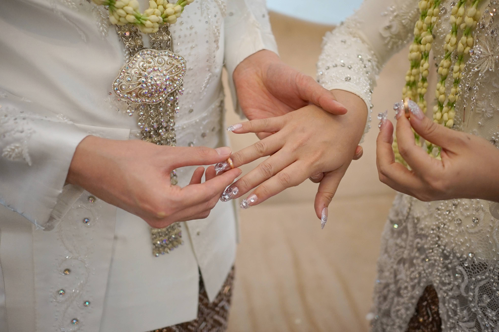
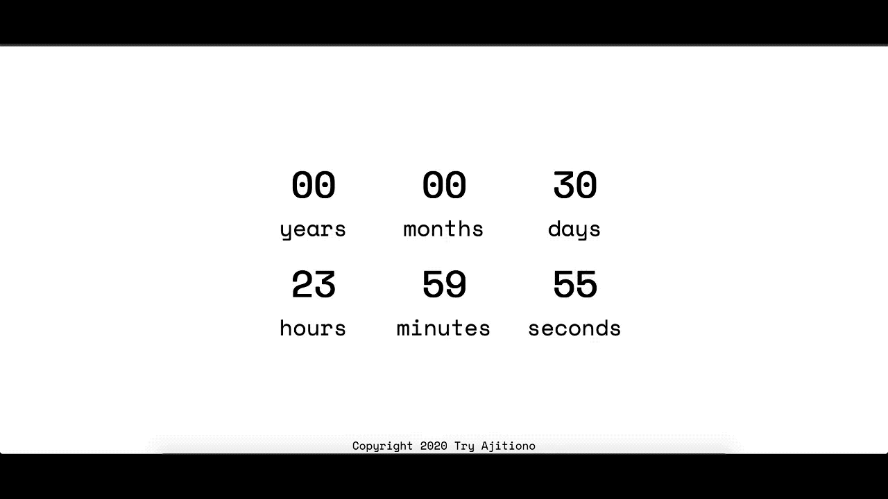

I had a question before I got married, "Will emotional affection last forever? Will a husband and a wife's chemistry deplete over time?". Tony Stark once said, ["I guess we'll find out"](https://www.imdb.com/title/tt0848228/characters/nm0000375).

_DISCLAIMER: [@matahatigraphy](https://www.instagram.com/matahatigraphy/?hl=en) was our wedding photographer. They gave us the raw pictures and the edited pictures, but for this post, I can't find the edited ones that I wanted. Therefore, I took out the raw ones and tweaked them myself. If you have keen eye for photography stuff, I'm sorry if the following pictures hurt your eyes!_

<!-- What relationship is about. -->

For me, relationship is all about trust, patience, and empathy. I didn't know about that before -- I had to learn them the hard way. It sounds like an excuse, but I didn't really learn a lot about emotional intelligence in my family -- it simply didn't exist (and probably still doesn't). Anger was forbidden, sadness was forbidden, just keep up a mask of a happy face all day to prevent further problems.

Moreover, since the "culprit" in my parents' _house_ was a woman, it was really hard for me to really open up to the opposing gender, as I was afraid of getting a person with similar traits to her. Love was a topic that I would tread really, really carefully. Yes, I had crushes, but I kept questioning myself, "Is this love? Or is this lust?". I think I was being paranoid, while at the same time, I wanted someone who could match my puzzle piece. I was conflicting with my inner self most of the time.

Fast forward to May 2016, I got the internship that enabled me to do my thesis defense in September. Little did I know, the woman that I would fall in love with also worked in that company. It all started when I accepted the part-time offer after finishing my internship there -- I thought it was a great chance to improve my "actual real job skills", since until that time, I was mostly investing myself in my gaming career.

My wife -- her name is Hawa -- she used to drive her own car to the office. At one point, since I didn't live too far from her house, I wanted to join her on a ride back together, so she could drop me somewhere on her way home. The first ride was not intentional, but soon, it became a habit. I was lucky that she didn't mind.

We started going to the office together as well, where she would pick me up from "my pickup point". During the ride, we talked with each other -- from casual topics to a more personal ones. I got to know her as a person instead of just a colleague. We discovered each other's vulnerable selves. My mind began to question, "Is this the one?"

However, my paranoid self said, "Hahahaha. No. She is just like _that_ woman".

So, yes. My paranoid self won again. Shortly after I graduated, I went to a conference called [ICoDSE 2016](https://eventegg.com/icodse-2016/). There were a lot of my friends who got into that conference as well, hence it was a great time. We went to souvenir shops, where I bought a pair of sandals as a gift for Hawa. Until this day, I didn't know why I had that idea.

I arrived back in Bandung and took a day off (if I remember correctly). The next day, I gave Hawa the sandals. I must say, for a person who had such paranoid opening up to the opposing gender, I never saw such happiness in one's face when receiving a gift from me. I think that was the moment where my "paranoid castle" began to crumble, and so it did.

After that, it was a slow-but-sure ride. We got closer and closer, until we were "officially" together on March 2017. I thought slow buildup to the relationship would mean that we understood each other. I couldn't be more wrong. That was the moment where I began to learn 3 important things in life: **trust**, **patience**, and **empathy**.

<!-- Empathy and patience. -->

When I just started being together with Hawa, one of the words that would describe me most was **rigid**. Everything was binary in my eyes. It was either **true** or **false**, there was no between. Because of that, we had some good "fights". However, we always made up after each one. We resolved them and made action plans on what to do should similar events occur in the future.

With that said, there were stuff that we couldn't change overnight. We could change it, but we needed to be patient with each other. We needed to understand the other person that it wasn't easy to change. Hence, we learned **patience** and **empathy** together.

My life, which was monochrome, was beginning to have colors because of her.

<!-- Trust. -->

Then, it was about **trust**. Thankfully, we didn't have to go through fights to learn about this. We just trusted each other when we had to maintain Long Distance Relationship (LDR), as I was about to pursue my Masters at University of Melbourne, while Hawa was about to pursue hers at Institut Teknologi Bandung.

We scheduled a weekly video call, which was a bit tricky with Melbourne being 3-4 hours ahead of Bandung. There were times that I or she was busy and couldn't make it, so in that case, we scheduled the video call at a different time. Although we only did that once a week, we always kept a tab of each other every day with text chat. We made sure to respect each other's boundaries, because we both knew that each of us had a lot of stuff to do in our everyday life.

In March 2019, I had a chance to go to San Francisco. It was tough for both me and Hawa, because we had never experienced 14 hours of time difference before, despite the fact that it was only for ~8-9 days. My daytime was her nighttime, and vice versa. Although we could still text each other, we couldn't do our usual weekly video call schedule, because my times and her times didn't match. To make things worse, I also bought a SIM Card that wasn't compatible with my phone. Therefore, 2G was all that I had and I needed to rely on a Wi-Fi connection.

Every day, we tried to find good and matching times for both of us with no luck. However, few days before I flew back to Melbourne, I was free in the morning with a Wi-Fi connection (yay!). That was also the time she could have a video call with me, and so we did. It was a good experience for both of us.

<!-- Talk about the build-up to wedding. -->

<!-- Talk about the relation between emotional affection and the 3 aspects above. -->

- Talk about how long it's been since I've been married
- Shameless self-promotion on https://imballinst.github.io/married
- Talk about the background of the counter, mention about affection, which we will cover in the next section
- Tease a bit about upcoming post regarding the thought-process behind creating it. Ask questions! Ask the reader how they'd implement it and mention me in Twitter.

- Talk about affection and happiness in that image
- Throw back to the title of this post
- Remember what Mas Didit said, regarding "it's up and down -- just like faith. Sometimes it's down, but then it'll bounce back."

At the time of writing, I don't have the answer to my own question yet. But, I really hope the answer is **yes**, and I will try to make that happen.

- REMEMBER:
  -- Be careful with words. It's kinda a sensitive topic. Make sure I'm being specific and not being general. Try to always use "me" instead of "you", or "we", or "us".
  -- Credit MatahatiGraphy and mention their Instagram when possible (https://www.instagram.com/matahatigraphy/?hl=en), or simply "Instagram @matahatigraphy".
