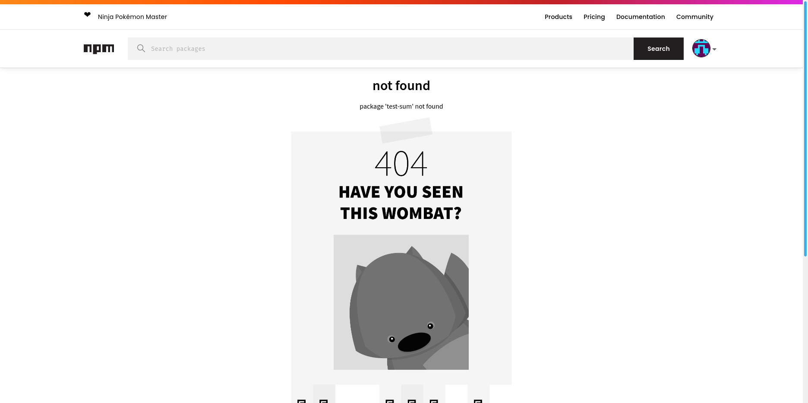
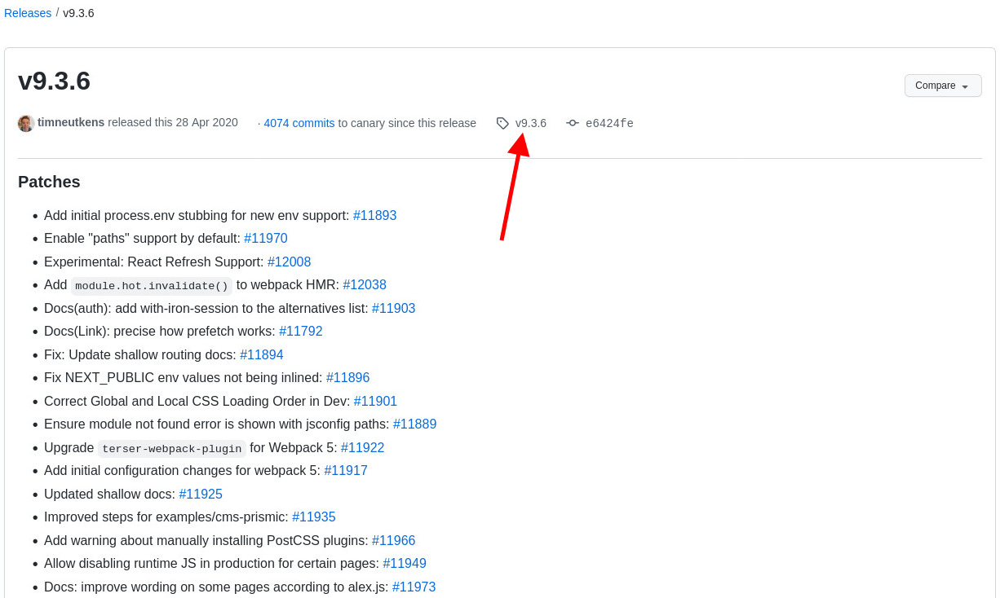

Hey! So, you want to publish your library to NPM registry? Nice! Publishing a library to a public registry has a lot of positives and probably 0 negatives, as long as your library doesn't contain malicious code. The positives are as the following (this list is not exhaustive):

- You can use your library in your projects without having to copy-paste them locally
- You build your brand (if it's a public library), because it will be linked to your public Git repository
- You can practice doing [semantic versioning](https://semver.org/) (if you plan to maintain it)

You probably don't have to worry having to maintain it, because you don't have an obligation to maintain. It's like what they said about side projects, a lot of them are in unfinished state and that's okay.

# Requirements

Here is the list of things that we need before we can do so:

1. Node.js® (this typically comes along with `npm`, so we don't have to worry about installing `npm` separately).
2. Git (can be CLI or UI).
3. A text editor of your choice (e.g. Visual Studio Code).
4. A remote Git repository in any Version Control System (VCS), such as GitHub.
5. **[Optional]** Yarn, if you prefer to use `yarn` instead of `npm` for managing the library and its dependencies.

For this post, I will be using Git CLI, Visual Studio Code, GitHub, and Yarn for the examples.

# Steps to publish

The following sections will contain the steps to publish your library. Let's get started!

## Log in to NPM

First, if you haven't registered yet, you need to do so at https://www.npmjs.com/signup. After that, it is recommended that you also set up two-factor authentication (2FA) in your account. You can do so by clicking your profile picture on the top-right, then click on "Account". You will be redirected to your account page and you will see "Two Factor Authentication" section on the right column, just below the "Email & Password" section.

After finishing all that, you can log in in your CLI by doing `npm login`:

```shell{outputLines: 2-6}
npm login
Username: your-username
Password: 
Email: (this IS public) your-username@gmail.com
Enter one-time password from your authenticator app: 123456
Logged in as your-username on https://registry.npmjs.org/.
```

Use the details that you used when registering: username, password, and email. If you have also set up 2FA in the previous step, then you will need to also input it. If all of these details are correct, then you will be logged in to NPM in your CLI.

## Create the library

To publish a "library" in the NPM registry, we must first define, _"What is a library?"_ A library is as simple as an `index.js` and a `package.json`, which contains at least `name`, `version`, and `main` fields in it. Before we start, let's create a Git repository in GitHub. After that, clone your repository to your local.

We are going to start with creating `index.js`. Let's say we are going to publish a sum function. Note that this is only for the sake of example. I don't recommend publishing a library that only does `a + b`. Later on we will tackle a more complex example.

```js
// index.js
module.exports = function sum(a, b) {
  return a + b;
};
```

Then, for the `package.json`:

```json
{
  "name": "test-sum",
  "version": "0.0.1",
  "main": "index.js",
  "repository": "git@github.com:your-username/test-sum.git",
  "author": "Your Name <your-username@gmail.com>",
  "license": "MIT"
}
```

Here, you can replace the `test-sum` to any kind of name that you want. However, it needs to not exist in the NPM registry. To check its availability, you can search for the package name here: https://www.npmjs.com/package/test-sum. At the time of writing, it showed me this page:



As a heads up, the repository name in GitHub doesn't have to be the same as the `name` field in `package.json`.

After the `name` field, we have `version` field. We can start with `0.0.1` for now. When we want to revisit it later, we might want to revisit this and practice semantic versioning (will be explained in later sections).

Next, we have the `main` field. This is the entry file that the library will be using. For example, when we do this in our code:

```js
const sum = require('test-sum');
```

What's happening is that, we are looking to `node_modules/test-sum/package.json` and read its `main` field. Then, it will find the entry file: `index.js`. Since our `index.js` exports a function, then the `sum` variable will contain the `sum` function from the `test-sum` library.

The next 3 fields, `repository`, `author`, and `license`, are more or less a metadata. Read more about `package.json` in the [NPM `package.json` documentation](https://docs.npmjs.com/cli/v7/configuring-npm/package-json). However, if you are adding the `license` field in the `package.json`, please ensure that you also read the next section, too.

## Add a LICENSE

A `LICENSE` file is important so that engineers who want to use your library know the limits. Quoting from ["Licensing a repository"](https://docs.github.com/en/repositories/managing-your-repositorys-settings-and-features/customizing-your-repository/licensing-a-repository) article from GitHub:

> Public repositories on GitHub are often used to share open source software. For your repository to truly be open source, you'll need to license it so that others are free to use, change, and distribute the software.

In this guide, we are going to go with MIT license instead. [This website](https://choosealicense.com/) explains all kind of licenses perfectly. In the case of MIT license, it is (quoted as-is), _"lets people do almost anything they want with your project, like making and distributing closed source versions"_.

## Publish to NPM registry

Publishing your library to NPM registry is quite straightforward. All you need to do is to execute this command:

```shell
npm publish
```

If that command is successful, the next time you do `yarn add test-sum` in a project (with `package.json` inside it), it will fetch the `test-sum` library from the NPM registry. There you have it, your own library!

# Advanced steps

Our library has been published. What next? Well, there are more things that we can do, especially if we are actively maintaining the library.

## Semantic versioning

[Semantic versioning](https://semver.org/) is a method to manage the versions of a "thing" (in this case, software) in an intuitive way. The common format is `x.y.z`, where `x`, `y`, and `z` are usually numbers, such as `2.11.0`. The explanation for each segment is as the following:

- The first segment `x` is the major version. When this version is bumped, _usually_ it introduces breaking changes, deprecations of certain features, or total restructure/rewrite of the software.
- The second segment `y` is the minor version. When this version is bumped, _usually_ it introduces new features.
- The third segment `z` is the patch version. When this version is bumped, _usually_ it involves bug fixes, non-breaking refactors, documentations, and other kind of chores.

A good example of this is [Next.js upgrade guide](https://nextjs.org/docs/upgrading). For each major version they published, they also prepared the migration guide for the users. This was because there may be some things that users were using in the previous major versions but were removed in the next major version, for example, the removal of [Webpack 4 support in Next 12](https://nextjs.org/docs/upgrading#webpack-4-support-has-been-removed). This was a breaking change, because the previously supported Webpack 4 syntaxes would not be available anymore.

## Release notes

A version in a software consists of multiple changesets. These "changesets" are "commits" in Git terms. When we have released a lot of versions, it may not be feasible to read through the entire Git commit history. It is for this purpose that we create "release notes" to combine the commits. Consider this case:

**User:** _"Hey, I found this bug where the X function is not working properly when given the input Y."_
**Maintainer:** _"Thanks for reporting! Could you tell me which version is this?"_
**User:** _"I am using the version that was released last year: 2.11.0."_
**Maintainer:** _"Sure! I'll look into it."_

Let's say that there have been N commits since last year (where the maintainer doesn't know the exact number of N), it will not be easy to pinpoint the commit that belongs to version `2.11.0`. However, with a proper release notes, we can find the exact version along with the changes that came along with it. For example, in the same Next.js repository, if we want to look back to a particular version, say, `v9.3.6`, we can just visit this link: https://github.com/vercel/next.js/releases/tag/v9.3.6 and see the list of commits there. If we want to debug further, we can click the "v9.3.6" link (see screenshot below).



When clicked, we will be shown the repository state when that version was published.


Using the same fashion, using Git CLI, we can also do the same to browse the files in version `9.3.6` locally:

```shell
git checkout v9.3.6
```

## Add `.npmignore`

By default, our library will use `.gitignore` (if present). Hence, if `node_modules` is already included in `.gitignore`, then it will not be published to the registry.

However, sometimes we want to cut down the uploaded package even more. Ideally, only key files and folders should be included in the package to reduce "unpacked package size". In case I am confusing, let's take one of my libraries, [`count-up-down`](https://github.com/imballinst/count-up-down/compare/v0.0.1...v0.0.2), as an example and see the changes to `.npmignore` file.

```
  examples/
+ docs/
+ notes/
+ 
+ .prettierignore
+ .prettierrc
+ 
+ jest.config.js
```

Why did I exclude all of these files? Because these files are only for development and documentation purposes. The published package only needs the entry file and files linked to it. It doesn't need all of the development-enhancing things (such as Prettier and Jest configurations) and examples.

For further reading on `.npmignore`, please read more about ["Keeping files out of your package" in NPM documentation](https://docs.npmjs.com/cli/v7/using-npm/developers#keeping-files-out-of-your-package).

## Do `npm publish --dry-run`

Before publishing, perhaps it can be a good idea to take a look to your project folder. What if you accidentally included a sensitive information in an environment file, say, `.env` and you forgot to include it in `.gitignore`?

<!-- TODO -->

## Do `npm link`

<!-- TODO -->

- [ ] You'll need a NPM creds, log in or create one
- [ ] `npm init` or `yarn init`, probably doesn't matter. As long as there is `package.json` (and optionally lockfile if you use deps)
- [ ] Create `index.js`
- [ ] In the index file, set `main`
- [ ] Set LICENSE
- [ ] Set version with `npm version x.x.x` (this will also create a new tag), then `npm publish`
- [ ] Push to your Git repository the code and also `git push <remote> --tags` to push the tag
- [ ] Optionally, create a release note from the pushed tag

Things to look out for:

- [ ] Check `.npmignore` to reduce unpacked library size
- [ ] Do `npm publish --dry-run` to see which files and folders are uploaded to the registry. Not all files and folders need to be uploaded
- [ ] Do `npm link` or `yarn link` to test the package locally
