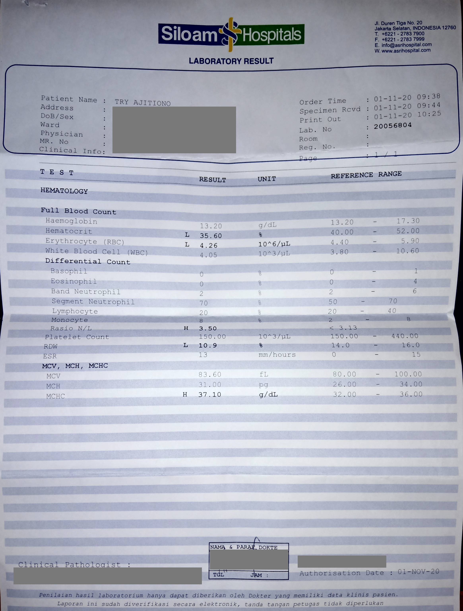

_"Woah, woah, woah, hold on! This is the first post about therapist visit and you are telling me that this is part 4? Where are the previous 3 parts?"_ Unfortunately, for the first therapist visit, I was really all over the place. According to my therapist, my stories back then were unordered [timeline-wise], which is true, because I didn't know where to start. For the second and third visit, I did have a note but I forget where did I put it... so, yeah. Anyway!

## Topics

I made a proper preparation before visiting the therapist, because I wanted to make sure that I could get answers for whatever I was feeling at that time. Here were the list of things that I wanted to share:

### Relationship between health and stress level

In mid-October, my father teased that my rabbits [in my parent's home] were looking for me. I took that as he wanted me to visit him and my mother. At that time, I wasn't really on good terms with my mother because of the house-building stuff. I overthought that and the day after, I didn't feel quite good in the afternoon, and by night my body temperature was 37°C. The next few weeks, yeah, I was battling with constant fever, up to 39.3°C. I didn't tell my family about this... though my in-laws knew about this from my wife. That was more or less the same kind-of sickness that I was getting in February 2020. Fever, tick. Possible cause from stress, tick.

Two weeks since, I was still hesitating to go to hospital because of the pandemic condition. However, because my wife and her family pushed me [and also because I had seen her exerting so much effort in taking care of me], I gave up and so we went to the emergency room of the hospital. I got an infusion and the doctor prescribed me with some medicines, some for my fever, some for my nausea. From the full blood test, it appeared that I had some blood cells were in a not-so-good state, such as the red blood cells and platelets were lower than it should. It wasn't typhus or dengue... it was a common viral infection, my doctor said. Thankfully, I recovered in 1 week after that, though not fully fit yet.

<!-- Give picture here for the lab test. -->

---

With regards to this, my therapist said something about the relation between stress and platelet count. She said that she also faced the same thing in her life. In February, two years in a row, she was sick but the doctors couldn't figure out what the sickness was. What she knew was that her platelet count was lower than usual, but it was the same like me—neither it was typhus or dengue fever.

She figured out that during these times, her life was quite stressful. After that, in a conference related to psychology, she said that she met with Carl Jung's grandchild [if I remember correctly] and they told her that mental stress can impact blood cells, in particular platelets. So, probably that was the case for me twice last year (February and October).

Although what she said validates my concerns that mental health can affect health, which fed my ego because back then [there were people who said happiness doesn't affect health](https://peepohappy.id/blog/top3-achievements-frustrations-2020), I will still try to find references to ensure that what she said was valid. Bear in mind that I am not an expert in this field, so my thinking below **could** be wrong... and you don't have to agree with me.

Instead of finding facts that back up my therapist's argument, I found that [mental stress raises platelet activity](https://link.springer.com/article/10.1007/s11481-020-09945-4)... which is probably a good thing? I looked up on [thrombocytopenia](https://www.mayoclinic.org/diseases-conditions/thrombocytopenia/symptoms-causes/syc-20378293), a condition which someone has a low platelet count.

> Thrombocytopenia might occur as a result of a bone marrow disorder such as leukemia or an immune system problem. Or it can be a side effect of taking certain medications. It affects both children and adults.
>
> Thrombocytopenia can be mild and cause few signs or symptoms. In rare cases, the number of platelets can be so low that dangerous internal bleeding occurs. Treatment options are available.

In my case, thankfully my platelet count didn't drop too low to the extent that internal bleeding occurred. Since I didn't have bone marrow disorder, I looked up on [what might cause a problem on my immune system](https://www.webmd.com/balance/stress-management/news/20180619/severe-stress-may-send-immune-system-into-overdrive).

> Comparing more than 106,000 people who had stress disorders with more than 1 million people without them, researchers found that stress was tied to a 36 percent greater risk of developing 41 autoimmune diseases, including rheumatoid arthritis, psoriasis, Crohn's disease and celiac disease.

After looking up on the list of autoimmune diseases... I don't think it fit my cases back then, as that list of diseases seems scarier than what I suffered. Back to the Mayo Clinic article:

> Platelets are produced in your bone marrow. Factors that can decrease platelet production include:
>
> - Leukemia and other cancers
> - Some types of anemia
> - Viral infections, such as hepatitis C or HIV
> - Chemotherapy drugs and radiation therapy
> - Heavy alcohol consumption

Viral infections seem more like it, as my doctor said it was probably viral infection when I was getting my infusion. I know that viruses can't break through our body's immune system unless it is weaker than the virus, so I searched for more references and found the article, ["Stress, Illness and the Immune System"](https://www.simplypsychology.org/stress-immune.html).

> When we’re stressed, the immune system’s ability to fight off antigens is reduced. That is why we are more susceptible to infections.

I also discovered similar fact from Healthline, ["Effects of Anxiety on the Body"](https://www.healthline.com/health/anxiety/effects-on-body#Immune-system).

> In the short term, this increases your pulse and breathing rate, so your brain can get more oxygen. This prepares you to respond appropriately to an intense situation. Your immune system may even get a brief boost. With occasional stress, your body returns to normal functioning when the stress passes.
>
> But if you repeatedly feel anxious and stressed or it lasts a long time, your body never gets the signal to return to normal functioning. This can weaken your immune system, leaving you more vulnerable to viral infections and frequent illnesses. Also, your regular vaccines may not work as well if you have anxiety.

I think this was also what my therapist said to me during our session (but I forgot to write it down). So, I guess, "mental health impacts physical health" is a valid argument? Maybe. But, even if you don't think it is because there hasn't been any thorough research about it, I suggest you to be kind to people, that's all. It's simple, really. What does it cost for you to be good to people? None.

### The calm before the storm

In December, I and my wife planned to go to Bandung to visit my in-laws. We prepared that intensely—we decided that we would isolate ourselves in hotel for 2 weeks and do [PCR test](https://en.wikipedia.org/wiki/Polymerase_chain_reaction)—just to ensure we wouldn't be a spreader.

Before traveling to Bandung, we visited my parents first for a quick catch-up. At that time, I hadn't seen my mother for like 3 months because I didn't (and don't) have the best relationship with her (see ["Marriage and Emotional Affection"](https://peepohappy.id/blog/marriage-and-emotional-affection)). Again, thankfully no dramas were produced during that occasion. Our plans went as we expected: we went to the hotel, we isolated ourselves, got ourselves PCR-tested, and then we went to our in-laws house.

### The storm

On January 11, 1 day before we went back to Jakarta, suddenly my mother flooded my WhatsApp with all kind of ramblings related to COVID-19. It was like exactly how it was when COVID-19 entered Indonesia: she bombarded me with COVID-19 related news more than 3 times a day. Eventually, I fed up and I muted all keywords related to COVID-19 in Twitter because I want my timeline to be my safe space. I also told her that "these news are boring". I mean, I didn't even go outside the house. I work remotely. It wasn't like I went outside to co-working space everyday to work.

Anyway, for this case, I didn't know what was the trigger for her to do that to me. During our stay in Bandung, we didn't really go outside unless it was absolutely necessary (e.g. my sister-in-law's family got food poisoned at that time so we needed to take care of them). I straight got panic attack at that time and cried on the bed. It lasted for 2 hours before I could finally go back to work.

On January 14, my father told me that he was tested positive for COVID-19 and currently self-isolating at home. I thought, "right, probably this was what causing my mother to shovel all of her ramblings to me". At that time, I didn't really feel anything. I felt like I probably should have felt only sympathy for my father. I didn't. It was a conflict, a mix of sympathy and ignorance. I felt sympathy because he was my father after all, but at the same time I didn't want to "care" because he let my mother be a dictator in the house and _broke_ our family... my brothers in particular. It's not like a "broken family" that we usually hear of, but the damage is there.

Day after day, what I noticed that my father wrote less text to me and his texts contained a lot of typos, so I could only guess if his condition got worse, although he always denied it. One day, my mother "forced" me and my wife to visit him, with the hope that we would lift his spirits and all that. That was conflicting. People were discouraged to visit COVID-19 patients to prevent further spreading, but here we were, getting invited to visit one. We did so though, just to "please" my mother, although she doesn't really get pleased by anything.

When we arrived there, I legitimately wanted to cry. He was really thin compared to last time I saw him. The way my mother treated him also didn't help. My father was in a weak condition, how could she yell at him? My mother would ask my father a lot of things when my father's voice was already low that we could barely hear him. Surely, there is a thing called empathy? We decided to not stay there longer because we couldn't bear the scene. Before we left, my mother shouted from the first floor [to my father who was on the second floor], "You're not sick anymore. That's just your psychology. Doctor Ronal said that the virus can only stay for 10 days in our body".

Yes, speaking of which, during my panic attack on January 11, she also sent me that video of Doctor Ronal and quoted what he said every now and then, as if her life depended on it. She held strongly the argument that as long as there was no fever, it was going to be fine.

Guess what? The next night, from my mother's story, his body temperature rose to 37°C. The next day, he was brought to the emergency room in a hospital. The doctors/nurses did tests (including roentgen) and showed us the result. What I could say is, what people posted on social media weren't lies. There were a lot of "white stuff" on my father's lungs. His blood-oxygen saturation was around 70% when he arrived, so he needed some machines to help him breath. We could only pray from that moment, and unfortunately, I went home with my mother along with my father's driver. Along the road, she quoted again this "Doctor Ronal" and it made me sick. I just stayed quiet and hoped I wouldn't lose my temper.

This was why I was really mad when there was a doctor who said that [there relationship between health and happiness aren't confirmed scientifically yet](https://www.instagram.com/p/CFEyUDcnstM/). If what he said reached my mother, who knew what she could have done. Maybe she would have treated my father worse, using the doctor's argument as an excuse.

The next day, my brother asked me to go to my parents' house to get my father's luggage (which he prepared the day before going to the emergency room) and his phone. However, when I told my mother so, my mother said lines like, "Why do we need his phone? Your brother is just the same like your father, he won't listen to me. He's heading towards insolence". The "insolence" word was what triggered my panic attack, again. I had been threatened with "insolence" words in the past, so reading that word again from her really spiked my stress levels up.

I turned off my phone for 1 day. I could only remember having "numb" feeling the whole day. I didn't feel like living.

After that, I tried to turn my phone back on and recognized that my mother had created a group that consisted of her, me, my wife, my oldest brother and his wife, and my brother (who was living in Japan). The group's purpose was mostly to talk about the condition of my father and insurance stuff. I was mostly just silent reading the group. Sometimes, I needed help from my wife to "decipher" what was going on in the group because my brain was still screwed up.

Fast forward few days later, my father was transported to another hospital that had an ICU room available (there were no available ICU rooms in the current hospital where he stayed in the emergency room). After that, we could relax a bit, because my father would receive a proper care. At this moment, I and my wife decided it was the right time to visit the therapist.

---

My therapist said that I was conflicted when I learned my father was positive because there wasn't enough emotional bond between me and him... which was true. Sometimes, I hoped my father would be assertive towards my mother when she did something wrong. That wasn't the case, he let things go on, he told us to keep our [me and my brothers] mouths shut. As such, there were "unresolved feelings" inside us... or at least, inside myself.

I also felt as if my father and my oldest brother were lying to me. Before my marriage, they said something along the lines, "After you get married, you will be free". However, we do not really live "free". We still feel my mother's grasp. Even she forced to cancel the apartment unit that I had rented in favor of the apartment unit that she chose... just because its rate was cheaper. Yes, it is cheaper, but its interior is inferior than the one that I chose. The stove's height is really low, as well as the kitchen sink. Every time I did the dishes, my waist always hurt because I needed to bend my back. Still, my father did nothing.

Freedom is really all about the parenting standards, my therapist said, and is quite common in Indonesia. For a child to be free from their parents' dictation, they must break through their parents' standards, which _can_ include: having more wealth than them, making a living for them, having more children than them, having higher degree than them, and many others, perhaps.

As with my mother restricting my father from his phone, my therapist said that COVID-19 patients, to the contrary, should be allowed to use their phone—though with care. She said that COVID-19 patients are really having a tough time. They are sick and people can't visit them. Phone is the only thing that makes them reachable and in turn, make them feel "less alone".

## Some "techniques" and/or "tools" that I learned

On top of getting explanation on my screw ups, I also learned about things that could possibly help me when facing similar challenges in the future.

1. **Mindfulness**: This is mostly about knowing my limit. I should be aware when I'm starting to get stressed. After I realize that it [the anxiety thing] is happening, as soon as possible I need to find/do things that could drop my stress levels.
1. **Usage of essential oils**: I think this is a good suggestion and there's a supporting argument in [this article](https://www.healthline.com/health/anxiety/essential-oils-for-anxiety) as well, _"Aromatherapy is often used as a natural remedy to relieve anxiety and stress"_. I and my wife have been using aromatherapy since I recovered from the viral infection in November, but we only use it in our bedroom. Probably it would be good if we use it in the living room as well because definitely anxiety and stress don't care about the location of occurrence.
1. **Narrating from third point of view**: I thought this is similar to journaling—it is not. When we do journaling, we tend to do it from _our_ point of view. Narrating, on the other hand, is done in the third point of view. By doing this, we increase the chance to see the issue that we are currently facing _from the outside_, which eliminates some bits of subjectivity in the process.
1. **Learn to be assertive**: The reason I was a silent reader in my family group was because my mother and my oldest brother were both dominant and I didn't want to take collateral damage from their debate (not to mention it was really tough to decipher their discussion). It is okay for me to declare that I don't want to be dragged into the middle of a "war".
1. **Facing guilt is worse than facing hardship**: With the previous reason said, there are times where I should probably have voiced my arguments as well, for example, when I truly wanted to contribute but hesistated because of the heated discussion. My therapist told me that facing guilt is worse than facing hardship. This is really true, because I felt like I should contribute, but because I didn't want to be a victim of war, I shut myself up... at the cost of me second-guessed my decision the whole day.
1. **Set boundaries**: Boundaries are really important. We should explicitly say "yes" to everything that is okay to us and "no" to everything that isn't. Sometimes, people without empathy think that silence means "yes"... which is often not the case. This also means there are things that we can't control. As such, we should focus on what we can control instead. For example, I can't control other people attitude, but I can control my reactions to their attitude. This is really hard for me because I think I'm a people pleaser type-of-person. Sometimes I do forget about it... and this is something that I need to work on.
1. **Paraphrasing**: As I wrote in the previous point, I am this kind-of people pleaser. This makes me an easy victim for my mother. Whenever she bombarded me with gazillion of messages, I foolishly always tried to read and decipher them all. This led to me getting emotionally exhausted, because most of her messages have only one core... which was hidden—whether it was in the long wall of text, or it hadn't come out yet. [Paraphrasing](https://www.scribbr.com/citing-sources/how-to-paraphrase/) is a technique where we repeat what the others have said in our own words. From what my therapist told me, by paraphrasing, I can "pull out" the core of my mother's message without needing to think extra hard to decipher her message. Basically, just reply with her own words and let her re-think what she said before. Eventually, she will reach the core of the message herself.

## The aftermath

Since my father was admitted to the ICU room, everything went better. We could ask about his condition from the nurse via phone, and I didn't realize how happy I was when I could hear him talk normally again when he was permitted to receive phone calls inside the room.

When my father was tested negative, the hospital gave him the green light to go back home to self-isolate and recover. However, one day after, he and my mother had a debate. My mother thought that he shouldn't use his phone because it would cause him stress. My father thought otherwise—he needed it to have "fun". My mother threatened: if he wouldn't give up his phone, then my mother would go. My father didn't want to give up his phone, and so my mother went. My brother (who was already living in his own home), came to pick him up so his family could take care of him.

I don't usually write religious things here, but during a prayer that night, I cried when I recited the beginning of the final verse of Surah Al-Baqarah (Q2:286), with the translation as the following:

> Allah does not burden a soul but to the extent of their ability; for it is what it has earned (positive degrees), and upon it what it has earned (negative degrees).

I had never cried so hard when I recited a verse of Quran during a prayer before. I thought of my father. He just got back home from a severe illness and was on the process of recovery, but his wife didn't treat him well, threatened to leave him, and finally left him. I genuinely couldn't imagine how it felt. I just trusted God at that time that He knew my father was a strong person and he would be okay.

At the moment, my father is recovering well. He said to me that what improves the recovery process is the peace of mind. Although my brother's house isn't as big as his, there is peace in it. Probably it's because there is no one to yell and dictate him around. Please include him in your prayers so that he can get back to his tip-top condition.

## Closing words

Hopefully this post is useful. Whoever, whenever, wherever you are, if you are currently facing a hardship, I'm hoping that God makes it easier for you to face it. If you are currently living a good life, please don't forget to lend a hand to those who need it.
